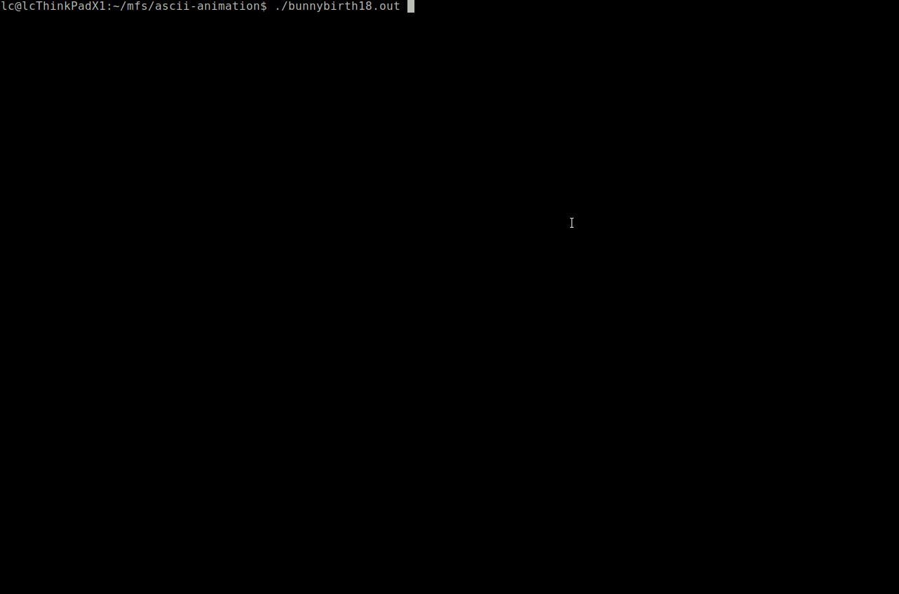

# Console ASCII Animation System

[Chang Liu](http://ml.cs.tsinghua.edu.cn/~changliu/index.html) \<<liuchangsmail@gmail.com>\>

The project is motivated as a birthday gift for Suki H. in 2017 and is inspired by the [Yahoo! Logo ASCII Animation](https://www.a1k0n.net/2011/06/26/obfuscated-c-yahoo-logo.html) code snippet (attached and parsed in the folder [`./refs/`](./refs/)) by [Andy Sloane](https://github.com/a1k0n/).
The project implements standard common basic shapes, tools for combining them into general shape objects, and common motions and dynamics for animating them.

Note: `bunnybirth17.cpp` can only be compiled with the first version of `ascii-anim.cpp` and `ascii-anim.h` for now.

* For 2017 birthday (`bunnybirth17.cpp`):

* For 2018 anniversary (`bunnypiggy18.cpp`):

* For 2018 birthday (`bunnybirth18.cpp`):

