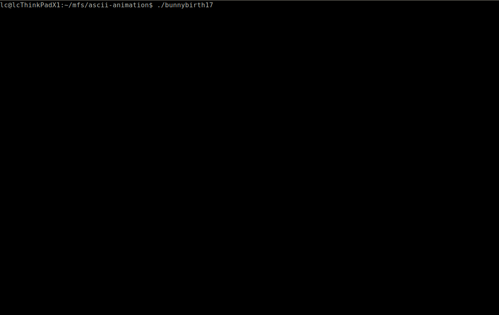
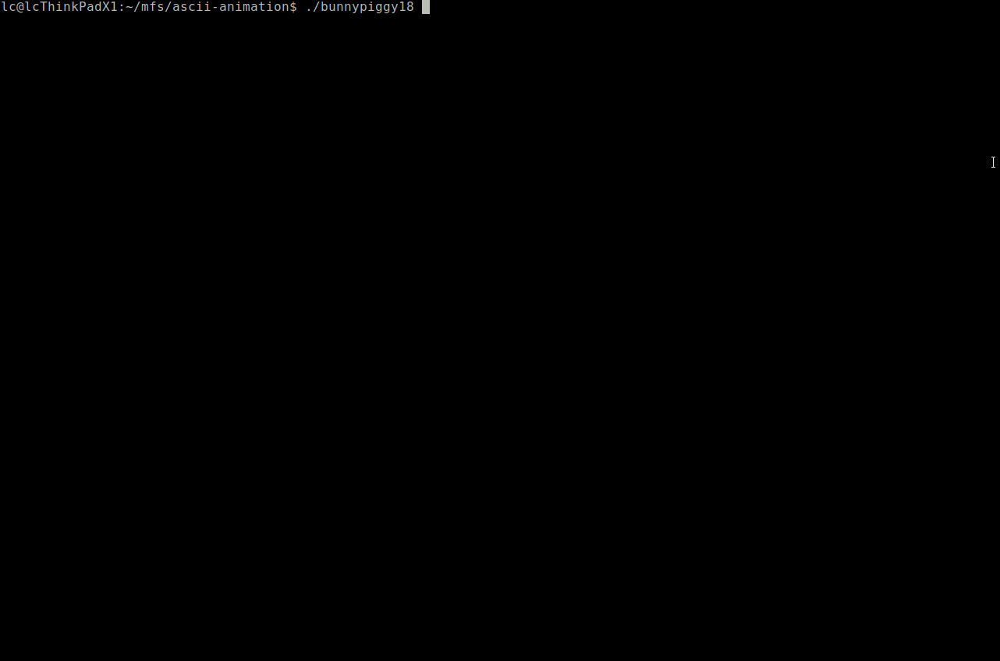

# Console ASCII Animation System

[Chang Liu](http://ml.cs.tsinghua.edu.cn/~changliu/index.html) \<<liuchangsmail@gmail.com>\>

The project is motivated as a birthday gift for Suki H. and is inspired by the [Yahoo! Logo ASCII Animation](https://www.a1k0n.net/2011/06/26/obfuscated-c-yahoo-logo.html) code snippet (attached and parsed in the folder [`./refs/`](./refs/)) by [Andy Sloane](https://github.com/a1k0n/).
The project implements standard common basic shapes for building general shape objects.

This version is updated for the 3rd anniversary with Suki H. (`bunnypiggy18.cpp`).
There are major changes in `ascii-anim.cpp` and `ascii-anim.h`: object motion tools are organized and incorporated into the framework, and object construction by intersection is enabled.

Note: `bunnybirth17.cpp` can only be compiled with the first version of `ascii-anim.cpp` and `ascii-anim.h`.

* For 2017 birthday (`bunnybirth17.cpp`):

* For 2018 anniversary (`bunnypiggy18.cpp`):

